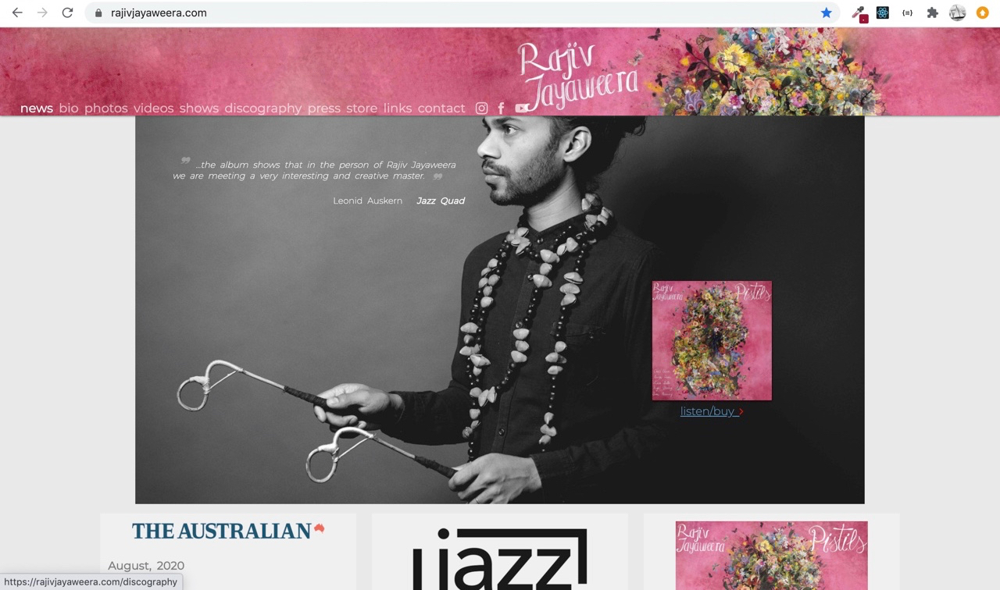
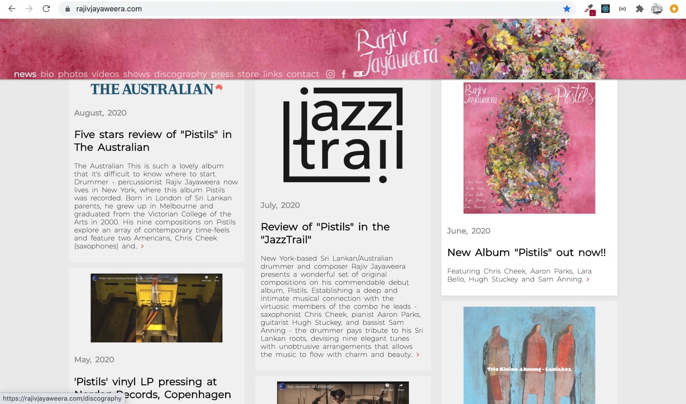

# Description
# Artist Profile web app

This artist profile web app is going to feature the work of and information about jazz drummer and composer Rajiv Jayaweera. Users will be able to learn more information, listen to the music, purchase/download music files and sheet music, download relevant information for press and booking.

# Mockups

DESKTOP

DISCOGRAPHY

 

DISCOGRAPHY

# MVP

Simple navigation trough several pages (about, music, videos, store, contact) with information and ability to download files. Integration with PayPal in the store section.

# Post MVP

 Music player, CMS for performance entries and updates. Streaming.
